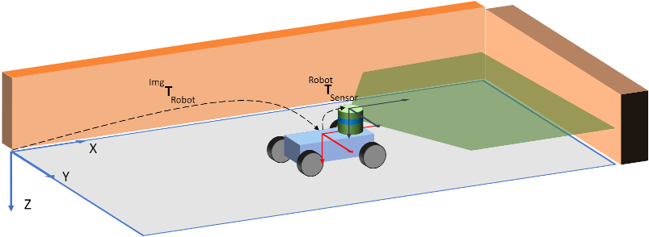

# Introduction
A very traditional problem in the field of classic probabilistic robotics is the global localization problem.

Assume, that you have a small mobile robot traveling around its world.

The fundamental question which needs to be answered for precise navigation is

**Where am I ?**

If you know where the robot is, you can start telling him where to go next.

Therefore, this challenge is to answer the question above.

## The World

The world of our robot is provided by the bmp-file located in the root folder of this project. To make things easier we assume

that the robot operates in the image plane.

**The robot and its world**

Thus, the origin of the world coordinate system is in the top left corner of the image. 

The z-axis points into the image plane. The robot is equipped with a single sensor which can be compared to a lidar perceiving its environment in a 180° angle.

The transformation of the origin of the world is named as **$^{Img}T_{Robot}$**. 

The transformation of the robot to the sensor is named as **$^{Robot}T_{Sensor}$**.

## The Particle Filter*
In this challenge, a particle filter constituting a non-parametric Bayes filter shall be used to localize the robot. 
Here, the posterior distribution shall represented by a set of particles be denoted as

>´$\Chi_t = <x_t^{[1]},x_t^{[2]},...,x_t^{[M]}>, 1<=t<=M$

The number of particles **M** is often a large number, e.g., **M=10,000**.

Now the algorithm works as follows.

Assume $u_t, z_t$ to be the current control command and current measurement, respectively.

> $\bar{\Chi}_t = \Chi_t = \emptyset$

**for m=1 to M do**

> sample $x_t^m \propto p\left( x_t | u_t, x_{t-1}^m \right)$

> $w_t^m = p\left(z_t | x_t^m \right)$

> $\bar{\Chi}_t= \bar{\Chi}_t + <x_t^m, w_t^m>$

**endfor**

**for m=1 to M do**

> draw $\it i$ with probability $\propto w_t^i$

> add $x_t^i$ to $\Chi_t$

**endfor**

*S.Thrun, W.Burgard, D.Fox, "Probabilistic Robotics", The MIT Press, 2006

## The Implementation

The virtual sensor measurements are stored in the **measurement.txt** file.
The structure of the file per line is

[$x$  $y$ $\theta$ $\Delta x$ $\Delta y$ $\Delta \theta$ $m_1$ $m_2$ .... $m_N$], where $N \leq$ NUM_SENSOR_MEASUREMENTS (defined in Sensor.h).

$x$  $y$ $\theta$ $\Delta x$ is the ground truth where the robot is **after** its motion $\Delta x$ $\Delta y$ $\Delta \theta$.

The ground truth can be used for debugging but should not be an input to the particle filter.

The map where the robot operates is defined by **map.bmp**.

Now, implement the method 

> void executeParticleFilter(const char *filename, ParticleFilter &filter, std::shared_ptr<Sensor> sensorPtr)

defined in main.cpp to load the measurement file, read it line by line and execute the particle filter after every line reading.

In order to make the particle filter work, you have to implement the method

 > void filter(double dx, double dy, double dYaw, const double *measurement, uint32_t lengh)

 of the class ParticleFilter as well as

 > void computeWeight(const double *measurement)

of the class Particle.

In order to debug the algorithm, you can print the current posterior distribution to a bmp file simply by calling

void writeParticlesToMapImage(const char *filename)

at the end of every filter operation.

***Good Luck!***

